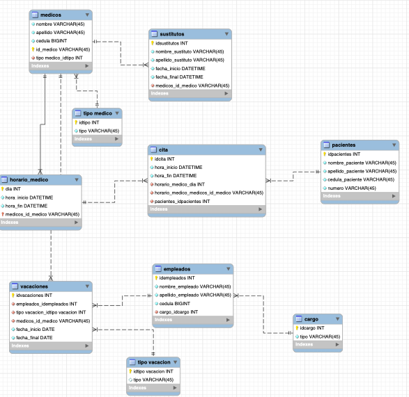

# Sistema de Gestión Clínica – Base de Datos MySQL

## Descripción

Este proyecto corresponde al diseño e implementación de una base de datos para la gestión de una clínica médica. El modelo fue construido en MySQL Workbench y posteriormente generado mediante Forward Engineering, lo que permitió obtener automáticamente el script SQL a partir del modelo entidad–relación.

El objetivo principal de la base de datos es organizar y estructurar la información relacionada con médicos, empleados, pacientes, horarios, vacaciones y citas, garantizando integridad referencial y coherencia en los datos.

---
## Modelo UML 



--- 
## Tecnologías utilizadas

* Base de datos: MySQL
* Motor de almacenamiento: InnoDB
* Herramienta de modelado: MySQL Workbench
* Lenguaje: SQL

Se utiliza InnoDB porque permite el uso de claves foráneas, lo cual es fundamental para mantener la integridad entre las tablas relacionadas.

---

## Estructura general del esquema

Se crea el esquema `mydb` para centralizar toda la información del sistema en un solo entorno organizado.

Durante el proceso de creación, se desactivan temporalmente:

* UNIQUE_CHECKS
* FOREIGN_KEY_CHECKS
* SQL_MODE

Esto se hace para evitar errores durante la creación de tablas con múltiples relaciones. Al finalizar el script, estas configuraciones se restauran para mantener las validaciones activas en el funcionamiento normal del sistema.

---

## Explicación de las tablas

### tipo medico

Esta tabla almacena los diferentes tipos o especialidades médicas. Se separa en una tabla independiente para evitar redundancia y permitir que varios médicos puedan compartir el mismo tipo sin repetir información.

---

### medicos

Contiene los datos personales de los médicos y se relaciona con la tabla tipo medico mediante una clave foránea. Esto permite que cada médico tenga asignado un tipo específico, manteniendo una estructura normalizada.

---

### cargo

Define los diferentes cargos dentro de la clínica. Se separa en una tabla propia para evitar repetir el nombre del cargo en cada empleado.

---

### empleados

Almacena la información del personal administrativo o auxiliar. Se relaciona con la tabla cargo mediante clave foránea, lo que garantiza que cada empleado tenga un cargo válido previamente definido.

---

### pacientes

Guarda los datos básicos de los pacientes. Se mantiene independiente porque el paciente es una entidad principal dentro del sistema y se relaciona posteriormente con las citas médicas.

---

### sustitutos

Permite registrar médicos sustitutos cuando un médico titular no puede atender. Se relaciona con la tabla medicos para indicar a quién reemplaza. Esta separación permite llevar un control histórico de sustituciones.

---

### tipo vacacion

Define los distintos tipos de vacaciones (por ejemplo, remuneradas, incapacidad, licencia, etc.). Se separa para evitar repetir descripciones y permitir futuras ampliaciones.

---

### vacaciones

Registra las vacaciones tanto de empleados como de médicos. Se relaciona con empleados, medicos y tipo vacacion, lo que permite mantener coherencia y asegurar que las vacaciones correspondan a personas registradas en el sistema.

---

### horario_medico

Define el horario laboral de cada médico por día. Se relaciona con la tabla medicos para establecer qué horario pertenece a cada profesional. Esto permite estructurar correctamente la disponibilidad antes de asignar citas.

---

### cita

Es una de las tablas principales del sistema. Permite registrar las citas médicas vinculando:

* El horario del médico
* El médico correspondiente
* El paciente

Se utiliza clave foránea hacia horario_medico y pacientes para asegurar que la cita solo pueda generarse si el horario y el paciente existen previamente.

---

## Justificación del diseño

La base de datos sigue principios de normalización:

* Se evita la redundancia separando entidades como tipo medico, cargo y tipo vacacion.
* Se utilizan claves primarias para identificar cada registro de forma única.
* Se implementan claves foráneas para mantener integridad referencial.
* Se usan tablas intermedias cuando es necesario manejar relaciones entre múltiples entidades.

Este diseño permite:

* Mantener coherencia en los datos.
* Reducir duplicidad.
* Facilitar futuras ampliaciones del sistema.
* Mejorar el rendimiento en consultas estructuradas.

---

## Instalación y uso

1. Instalar MySQL.
2. Abrir MySQL Workbench.
3. Ejecutar el script generado por Forward Engineering.
4. Verificar que el esquema `mydb` se haya creado correctamente.
5. Insertar datos de prueba para comenzar a realizar consultas.

---

## consultas

## 1. Número de pacientes atendidos por cada médico

```sql
SELECT m.id_medico,
       m.nombre,
       m.apellido,
       COUNT(DISTINCT c.pacientes_idpacientes) AS total_pacientes
FROM medicos m
JOIN horario_medico hm 
    ON m.id_medico = hm.medicos_id_medico
JOIN cita c 
    ON hm.dia = c.horario_medico_dia
   AND hm.medicos_id_medico = c.horario_medico_medicos_id_medico
GROUP BY m.id_medico, m.nombre, m.apellido
ORDER BY total_pacientes DESC;
```

---

## 2. Total de días de vacaciones por cada empleado


```sql
SELECT e.idempleados,
       e.nombre_empleado,
       e.apellido_empleado,
       COUNT(v.idvacaciones) AS total_vacaciones
FROM empleados e
LEFT JOIN vacaciones v
    ON e.idempleados = v.empleados_idempleados
GROUP BY e.idempleados, e.nombre_empleado, e.apellido_empleado;
```

---

## 3. Médicos con mayor cantidad de horas de consulta en la semana


```sql
SELECT m.id_medico,
       m.nombre,
       m.apellido,
       SUM(TIMESTAMPDIFF(HOUR, hm.hora_inicio, hm.hora_fin)) AS total_horas_semana
FROM medicos m
JOIN horario_medico hm
    ON m.id_medico = hm.medicos_id_medico
GROUP BY m.id_medico, m.nombre, m.apellido
ORDER BY total_horas_semana DESC;
```

---

## 4. Número de sustituciones realizadas por cada médico sustituto

```sql
SELECT s.medicos_id_medico,
       COUNT(s.idsustitutos) AS total_sustituciones
FROM sustitutos s
GROUP BY s.medicos_id_medico
ORDER BY total_sustituciones DESC;
```

---

## 5. Número de médicos que están actualmente en sustitución

(Suponiendo que fecha_inicio y fecha_final delimitan el periodo)

```sql
SELECT COUNT(DISTINCT medicos_id_medico) AS medicos_en_sustitucion
FROM sustitutos
WHERE CURDATE() BETWEEN fecha_inicio AND fecha_final;
```

---

## 6. Horas totales de consulta por médico por día

```sql
SELECT m.id_medico,
       hm.dia,
       SUM(TIMESTAMPDIFF(HOUR, hm.hora_inicio, hm.hora_fin)) AS horas_totales
FROM medicos m
JOIN horario_medico hm
    ON m.id_medico = hm.medicos_id_medico
GROUP BY m.id_medico, hm.dia
ORDER BY m.id_medico, hm.dia;
```

---

## 7. Médico con mayor cantidad de pacientes asignados

```sql
SELECT m.id_medico,
       m.nombre,
       m.apellido,
       COUNT(c.pacientes_idpacientes) AS total_pacientes
FROM medicos m
JOIN horario_medico hm
    ON m.id_medico = hm.medicos_id_medico
JOIN cita c
    ON hm.dia = c.horario_medico_dia
   AND hm.medicos_id_medico = c.horario_medico_medicos_id_medico
GROUP BY m.id_medico, m.nombre, m.apellido
ORDER BY total_pacientes DESC
LIMIT 1;
```

---

## 8. Empleados con más de 10 vacaciones registradas

```sql
SELECT e.idempleados,
       e.nombre_empleado,
       e.apellido_empleado,
       COUNT(v.idvacaciones) AS total_vacaciones
FROM empleados e
JOIN vacaciones v
    ON e.idempleados = v.empleados_idempleados
GROUP BY e.idempleados, e.nombre_empleado, e.apellido_empleado
HAVING total_vacaciones > 10;
```

---

## 9. Médicos que actualmente están realizando una sustitución

```sql
SELECT DISTINCT m.id_medico,
       m.nombre,
       m.apellido
FROM medicos m
JOIN sustitutos s
    ON m.id_medico = s.medicos_id_medico
WHERE CURDATE() BETWEEN s.fecha_inicio AND s.fecha_final;
```

---

## 10. Promedio de horas de consulta por médico por día

```sql
SELECT m.id_medico,
       hm.dia,
       AVG(TIMESTAMPDIFF(HOUR, hm.hora_inicio, hm.hora_fin)) AS promedio_horas
FROM medicos m
JOIN horario_medico hm
    ON m.id_medico = hm.medicos_id_medico
GROUP BY m.id_medico, hm.dia;
```

---

